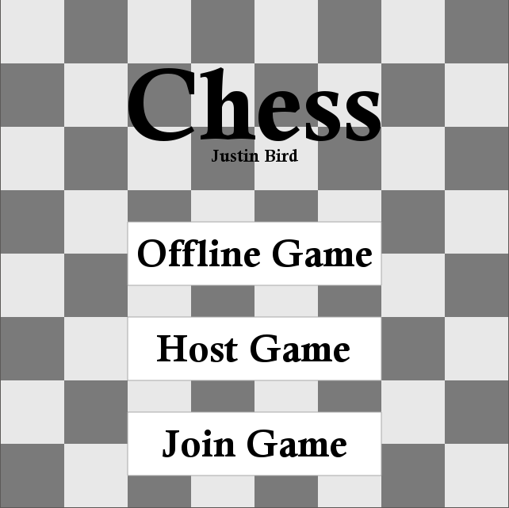
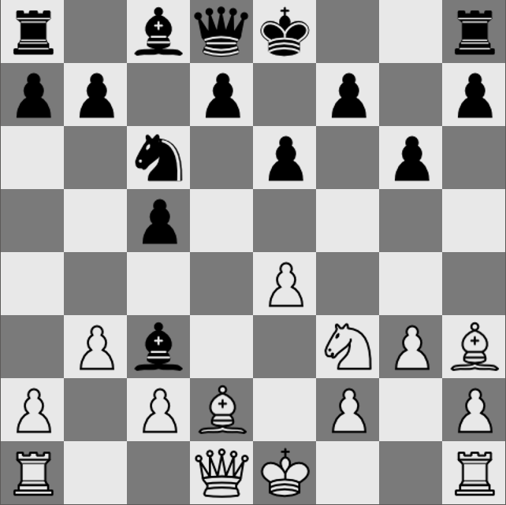

# Chess Game

## Description

This is a chess game that I created that you can play with your friends. Players can choose to play against their friend online or play locally on the same computer. Once you've
checkmated your opponent you've won and can choose to play them in another game!

## How to run

To build from source code you will need to:

1. Clone the repository to your local computer. If you just want to play the game, dont include the tests. If you want to run the tests remove or comment out main.cpp in the src folder.
1. Download [ofxUIUtils](https://github.com/DomAmato/ofxUIUtils).
1. Generate the project using the openFrameworks project generator. Don't forget to add ofxNetwork and ofxUIUtils to your project.
1. Build and run to play!

## Screenshots

